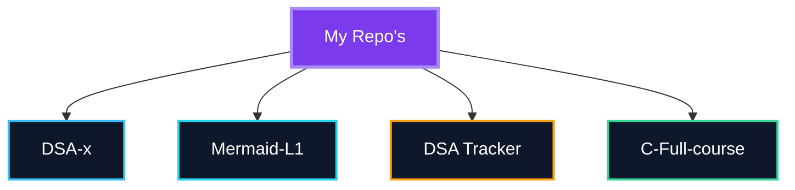

# Hey, I'm Ankit 👋

### 💻 Computer Science Student | C++ & DSA(Beginner) | Mermaid🧜‍♀️-L1

## My Repositories

```mermaid
flowchart TD
    A["My Repo's"]

    A --> B["DSA-x"]
    A --> C["Mermaid-L1"]
    A --> D["DSA Tracker"]
    A --> E["C-Full-course"]


    style A fill:#7c3aed,stroke:#a78bfa,color:#ffffff,stroke-width:3px
    style B fill:#0f172a,stroke:#38bdf8,color:#ffffff,stroke-width:2px
    style C fill:#0f172a,stroke:#22d3ee,color:#ffffff,stroke-width:2px
    style D fill:#0f172a,stroke:#f59e0b,color:#ffffff,stroke-width:2px
    style E fill:#0f172a,stroke:#34d399,color:#ffffff,stroke-width:2px

    click B "https://github.com/iamankitnanda/DSA-X" "Open Repo 1"
    click C "https://github.com/iamankitnanda/Mermaid-L1" "Open Repo 2"
    click D "https://github.com/iamankitnanda/DSA-Tracker" "Open Repo 3"
    click E "https://github.com/iamankitnanda/C-Full-course" "Open Repo 4"
```
